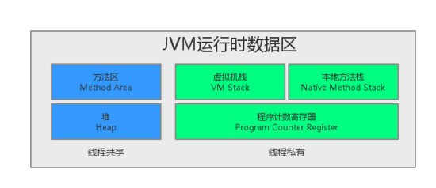

---

layout: post

title: JVM入门

tag: java语言

---
# JVM入门

## 1、什么是JVM

​	JDK(Java Development Kit) 是 Java 语言的软件开发工具包([SDK](http://baike.baidu.com/view/429424.htm))。**在JDK的安装目录下有一个jre目录**，里面有两个文件夹bin和lib，在这里可以认为**bin里的就是jvm，lib中则是jvm工作所需要的类库，而jvm和 lib合起来就称为jre。**

​	JRE（Java Runtime Environment，Java运行环境），**包含JVM标准实现及Java核心类库。**JRE是Java运行环境，并不是一个开发环境，所以没有包含任何开发工具（如编译器和调试器）

​	JVM是Java Virtual Machine（Java[虚拟机](http://baike.baidu.com/view/1132.htm)）的缩写，JVM是一种用于计算设备的规范，它是**一个虚构出来的计算机**，是通过在实际的计算机上仿真模拟各种计算机功能来实现的。

## 2、内部体系

JVM的内部体系结构分为三部分，分别是：类装载器（ClassLoader）子系统，运行时数据区，和执行引擎。

### 2.1、类装载器

​		每一个Java虚拟机都由一个类加载器子系统（class loader subsystem），负责加载程序中的类型（类和接口），并赋予唯一的名字。每一个Java虚拟机都有一个执行引擎（execution engine）负责执行被加载类中包含的指令。JVM的两种类装载器包括：启动类装载器和用户自定义类装载器，启动类装载器是JVM实现的一部分，用户自定义类装载器则是Java程序的一部分，必须是ClassLoader类的子类。

### 2.2、执行引擎

​			主要的执行技术有:解释，即时编译，自适应优化、芯片级直接执行其中解释属于第一代JVM，即时编译JIT属于第二代JVM，自适应优化（目前Sun的HotspotJVM采用这种技术）则吸取第一代JVM和第二代JVM的经验，采用两者结合的方式 。自适应优化：开始对所有的代码都采取解释执行的方式，并监视代码执行情况，然后对那些经常调用的方法启动一个后台线程，将其编译为本地代码，并进行仔细优化。若方法不再频繁使用，则取消编译过的代码，仍对其进行解释执行。

### 2.3、运行时数据区

主要包括：方法区，堆，Java栈，PC寄存器，本地方法栈。

#### 2.3.1、方法区域

在Sun JDK中这块区域对应的为PermanetGeneration，又称为持久代。方法区域存放了所加载的类的信息（名称、修饰符等）、类中的静态变量、类中定义为final类型的常量、类中的Field信息、类中的方法信息，当开发人员在程序中通过Class对象中的getName、isInterface等方法来获取信息时，这些数据都来源于方法区域，同时方法区域也是全局共享的，在一定的条件下它也会被GC，当方法区域需要使用的内存超过其允许的大小时，会抛出OutOfMemory的错误信息。

1. 被所有线程共享区域，用于存放已被虚拟机加载的类信息，常量，静态变量等数据。被Java虚拟机描述为堆的一个逻辑部分。习惯是也叫它永久代（仅仅是因为HotSpot虚拟机选择把GC分代收集扩展至方法区）；
2. 垃圾回收很少光顾这个区域，不过也是需要回收的，主要针对常量池回收，类型卸载。
3. 会有异常OutOfMemoneyError；

#### 2.3.2、堆

​		它是JVM用来存储对象实例以及数组值的区域，可以认为Java中所有通过new创建的对象的内存都在此分配，Heap中的对象的内存需要等待GC进行回收。

​    堆是JVM中所有线程共享的，因此在其上进行对象内存的分配均需要进行加锁，这也导致了new对象的开销是比较大的

​    Sun Hotspot JVM为了提升对象内存分配的效率，对于所创建的线程都会分配一块独立的空间TLAB（Thread Local Allocation Buffer），其大小由JVM根据运行的情况计算而得，在TLAB上分配对象时不需要加锁，因此JVM在给线程的对象分配内存时会尽量的在TLAB上分配，在这种情况下JVM中分配对象内存的性能和C基本是一样高效的，但如果对象过大的话则仍然是直接使用堆空间分配

​    TLAB仅作用于新生代的Eden Space，因此在编写Java程序时，通常多个小的对象比大的对象分配起来更加高效。

1. Java堆是java虚拟机所管理的内存中最大的一块；
2. 被所有线程共享区域，在虚拟机启动时创建，唯一目的存放对象实例；
3. 堆区是gc的主要区域，通常情况下分为两个区块年轻代和年老代。更细一点年轻代又分为Eden区最要放新创建对象，From survivor 和 To survivor 保存gc后幸存下的对象，默认情况下各自占比 8:1:1。 进一步划分的目的是为了更还的内存回收或者更快的内存分配；
4. 会有异常OutOfMemoneyError；

#### 2.3.3、JavaStack

​			虚拟机只会直接对Javastack执行两种操作：以帧为单位的压栈或出栈。每个帧代表一个方法，Java方法有两种返回方式，return和抛出异常，两种方式都会导致该方法对应的帧出栈和释放内存。帧的组成：局部变量区（包括方法参数和局部变量，对于instance方法，还要首先保存this类型，其中方法参数按照声明顺序严格放置，局部变量可以任意放置），操作数栈，帧数据区（用来帮助支持常量池的解析，正常方法返回和异常处理）。

1. 为执行Java方法服务
2. 当线程创建的时候，为线程分配一块内存区域，在线程执行的过程中，每个方法的执行都会创建一个栈帧，用于存放局部变量表、操作栈、动态链接，方法出口等。每个方法从被调用，直到被执行完。对应着一个栈帧在虚拟机中从入栈到出栈的过程；
3. 会有两种异常StackOverFlowError和 OutOfMemoneyError。当线程请求栈深度大于虚拟机所允许的深度就会抛出StackOverFlowError错误；虚拟机栈动态扩展，当扩展无法申请到足够的内存空间时候，抛出OutOfMemoneyError；
4. 它是线程私有的，生命周期与线程相同；

#### 2.3.4、ProgramCounter（程序计数器）

​	每一个线程都有它自己的PC寄存器，也是该线程启动时创建的。PC寄存器的内容总是指向下一条将被执行指令的饿地址，这里的地址可以是一个本地指针，也可以是在方法区中相对应于该方法起始指令的偏移量。若thread执行Java方法，则PC保存下一条执行指令的地址。若thread执行native方法，则Pc的值为undefined。Nativemethodstack(本地方法栈)：保存native方法进入区域的地址。依赖于本地方法的实现，如某个JVM实现的本地方法借口使用C连接模型，则本地方法栈就是C栈，可以说某线程在调用本地方法时，就进入了一个不受JVM限制的领域，也就是JVM可以利用本地方法来动态扩展本身。

1. 当前线程所执行的字节码指令的行号指示器，如分支、跳转、循环、异常处理、线程恢复都依赖程序计数器实现
2. Java多线程是通过线程轮流切换并分配CPU时间片来执行的，为了线程切换后能恢复到正确的位置，所以每个线程都有一个单独的程序计数器，所以程序计数器是私有的；
3. Jvm没有规定OutOfMemory的区块；

2.3.5、本地方法区

​	与java虚拟机栈所发挥的作用非常相似，它们之间的区别在于java虚拟机栈执行java方法服务的，本地方法栈是执行本地方法服务的。