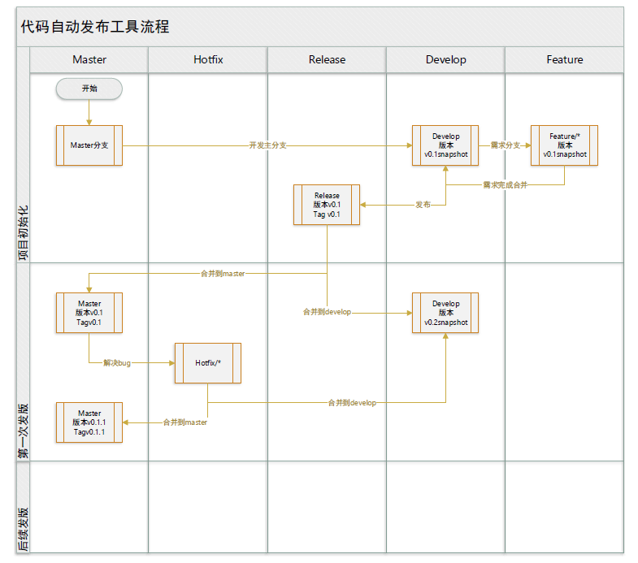

---

layout: post

title: Git flow

tag: CICD

---
# Git flow

## 1、前言

git已经是一个很优秀的版本管理工具了，但是面对现在复杂的开发流程，还是显得有点不足，比如这些问题

1. *如何开始一个Feature的开发，而不影响别的Feature？*
2. *由于很容易创建新分支，分支多了如何管理，时间久了，如何知道每个分支是干什么的？*
3. *哪些分支已经合并回了主干？*
4. *如何进行Release的管理？开始一个Release的时候如何冻结Feature, 如何在Prepare Release的时候，开发人员可以继续开发新的功能？*
5. *线上代码出Bug了，如何快速修复？而且修复的代码要包含到开发人员的分支以及下一个Release?*

大部分开发人员现在使用Git就只是用三个甚至两个分支，一个是Master, 一个是Develop, 还有一个是基于Develop打得各种分支。这个在小项目规模的时候还勉强可以支撑，因为很多人做项目就只有一个Release, 但是人员一多，而且项目周期一长就会出现各种问题。

## 2、gitflow内容

 就如同一些代码规范，git的版本管理，同样需要流程规范。如


说说这个流程里面常用的分支

- Production 分支

也就是我们经常使用的Master分支，这个分支最近发布到生产环境的代码，最近发布的Release， 这个分支只能从其他分支合并，不能在这个分支直接修改

- Develop 分支

这个分支是我们是我们的主开发分支，包含所有要发布到下一个Release的代码，这个主要合并与其他分支，比如Feature分支

- Feature 分支

这个分支主要是用来开发一个新的功能，一旦开发完成，我们合并回Develop分支进入下一个Release

- Release分支

当你需要一个发布一个新Release的时候，我们基于Develop分支创建一个Release分支，完成Release后，我们合并到Master和Develop分支

- Hotfix分支

当我们在Production发现新的Bug时候，我们需要创建一个Hotfix, 完成Hotfix后，我们合并回Master和Develop分支，所以Hotfix的改动会进入下一个Release。

整个流程像是这样



## 3、git flow操作

```
a. 创建develop分支
git branch develop
git push -u origin develop    

b. 开始新Feature开发
git checkout -b some-feature develop
# Optionally, push branch to origin:
git push -u origin some-feature    

# 做一些改动    
git status
git add some-file
git commit    

c. 完成Feature
git pull origin develop
git checkout develop
git merge --no-ff some-feature
git push origin develop
git branch -d some-feature
# If you pushed branch to origin:
git push origin --delete some-feature    

d. 开始Relase
git checkout -b release-0.1.0 develop
# Optional: Bump version number, commit
# Prepare release, commit

e. 完成Release
git checkout master
git merge --no-ff release-0.1.0
git push

git checkout develop
git merge --no-ff release-0.1.0
git push

git branch -d release-0.1.0

# If you pushed branch to origin:
git push origin --delete release-0.1.0   
git tag -a v0.1.0 master
git push --tags

f. 开始Hotfix
git checkout -b hotfix-0.1.1 master    

g. 完成Hotfix
git checkout master
git merge --no-ff hotfix-0.1.1
git push
git checkout develop
git merge --no-ff hotfix-0.1.1
git push
git branch -d hotfix-0.1.1
git tag -a v0.1.1 master
git push --tags
```

​	