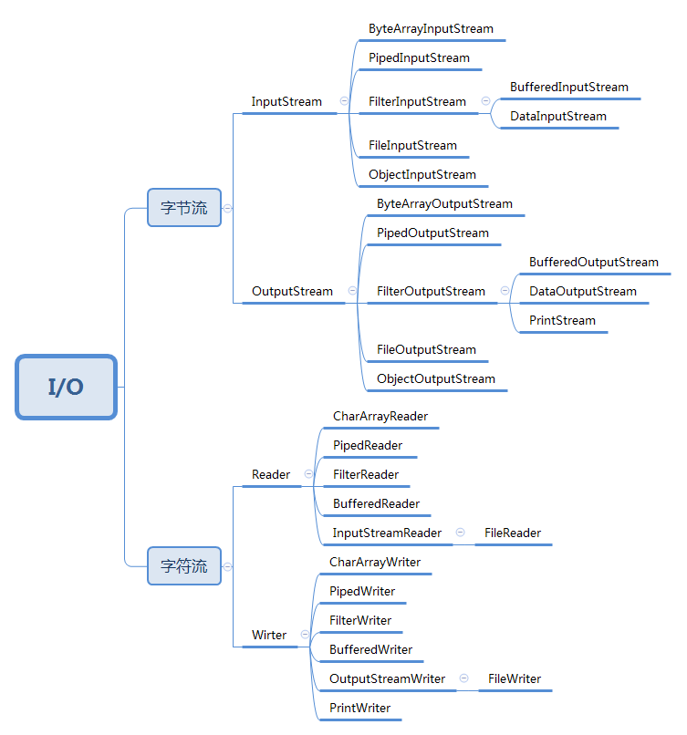

# java中的IO

## 1、java中的io概念

​	 无论是系统、还是语言的设计中IO的设计都是异常复杂的。面临的最大的挑战一般是如何覆盖所有可能的因素，我们不仅仅要考虑文件、控制台、网络、内存等不同的种类，而且要处理大量的不同的读取方式，如：顺序读取、随机读取，二进制读取、字符读取，按行读取、按字符读取...

​	Java库的设计者通过创建大量类来攻克这个难题。事实上，Java的IO系统采用了如此多的类，以致刚开始会产生不知从何处入手的感觉（具有讽刺意味的是，Java的IO设计初衷实际要求避免过多的类）

## 2、Java中的io分类

​	从操作对象来分。io大概可以分为以下几类

```
1、文件（file）：FileInputStream、FileOutputStream、FileReader、FileWriter
2、数组（[]）：
2.1、字节数组（byte[]）：ByteArrayInputStream、ByteArrayOutputStream
2.2、字符数组（char[]）：CharArrayReader、CharArrayWriter
3、管道操作：PipedInputStream、PipedOutputStream、PipedReader、PipedWriter
4、基本数据类型：DataInputStream、DataOutputStream
5、缓冲操作：BufferedInputStream、BufferedOutputStream、BufferedReader、BufferedWriter
6、打印：PrintStream、PrintWriter
7、对象序列化反序列化：ObjectInputStream、ObjectOutputStream
8、转换：InputStreamReader、OutputStreWriter
```

 从传输方法来讲只有两种

```
1、字节流
2、字符流  字符=3字节（utf8）2字节（gbk）
```

  

## 3、如何掌握java中的IO框架

​	  在整个Java.io包中最重要的就是5个类和一个接口。5个类指的是File、OutputStream、InputStream、Writer、Reader；一个接口指的是Serializable。

```
  1. File（文件特征与管理）：用于文件或者目录的描述信息，例如生成新目录，修改文件名，删除文件，判断文件所在路径等。
  2. InputStream（二进制格式操作）：抽象类，基于字节的输入操作，是所有输入流的父类。定义了所有输入流都具有的共同特征。
  3. OutputStream（二进制格式操作）：抽象类。基于字节的输出操作。是所有输出流的父类。定义了所有输出流都具有的共同特征。
  4.Reader（文件格式操作）：抽象类，基于字符的输入操作。
  5. Writer（文件格式操作）：抽象类，基于字符的输出操作。
  6. RandomAccessFile（随机文件操作）：一个独立的类，直接继承至Object.它的功能丰富，可以从文件的任意位置进行存取（输入输出）操作。
```

​	