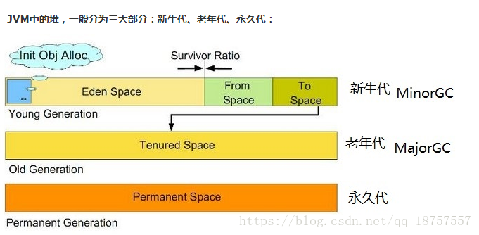

# GC详解

## 1、什么是GC

GC(garbage collec) java中的垃圾收集器。

Minor GC：新生代GC，指发生在新生代的垃圾收集动作，所有的Minor GC都会触发全世界的暂停（stop-the-world），停止应用程序的线程，不过这个过程非常短暂。

Major GC/Full GC：老年代GC，指发生在老年代的GC。

## 2、新生代，老年代，永久代

​	Java 中的堆是 JVM 所管理的最大的一块内存空间，主要用于存放各种类的实例对象。 

​	在 Java 中，堆被划分成两个不同的区域：年轻代 ( Young )、老年代 ( Tenured)。年轻代 ( Young ) 又被划分为三个区域：Eden、From Survivor、To Survivor。 这样划分的目的是为了使 JVM 能够更好的管理堆内存中的对象，包括内存的分配以及回收。



### 2.1、新生代

	堆大小 = 年轻代 + 老年代
	年轻代 = eden space (新生代) + from survivor + to survivor堆大小 = 年轻代 + 老年代
	年轻代 = eden space (新生代) + from survivor + to survivor
​		其中ServivorTo：保留了一次MinorGC过程中的幸存者。ServivorFrom：上一次GC的幸存者，作为这一次GC的被扫描者，MinorGC的过程：MinorGC采用复制算法。首先，把Eden和ServivorFrom区域中存活的对象复制到ServicorTo区域（如果有对象的年龄以及达到了老年的标准，则赋值到老年代区），同时把这些对象的年龄+1（如果ServicorTo不够位置了就放到老年区）；然后，清空Eden和ServicorFrom中的对象；最后，ServicorTo和ServicorFrom互换，原ServicorTo成为下一次GC时的ServicorFrom区。

​		但是JVM 每次只会使用 Eden 和其中的一块 Survivor 区域来为对象服务，所以无论什么时候，总是有一块 Survivor 区域是空闲着的。因此，新生代实际可用的内存空间为 9/10 ( 即90% )的新生代空间。

​		年轻代用来存放新近创建的对象，尺寸随堆大小的增大和减小而相应的变化，默认值是保持为堆大小的1/15，可以通过 -Xmn 参数设置年轻代为固定大小，也可以通过 -XX:NewRatio 来设置年轻代与老年代的大小比例，年轻代的特点是对象更新速度快，在短时间内产生大量的“死亡对象”。
年轻代的特点是产生大量的死亡对象,并且要是产生连续可用的空间, 为了提高内存的利用率所以采用复制回收算法进行垃圾回收.对年轻代的垃圾回收称作初级回收 (minor gc)

​		初级回收将年轻代分为三个区域, 一个新生代 , 2个大小相同的复活代, 应用程序只能使用一个新生代和一个复活代, 当发生初级垃圾回收的时候,gc挂起程序, 然后将新生代和复活代中的存活对象复制到另外一个非活动的复活代中,然后一次性清除新生代和复活代,将原来的非复活代标记成为活动复活代.将在指定次数回收后仍然存在的对象移动到老年代中, 初级回收后,得到一个空的可用的新生代.

​		Java 中的堆也是 GC 收集垃圾的主要区域。GC 分为两种：Minor GC、Full GC ( 或称为 Major GC )。
新生代几乎是所有 Java 对象出生的地方，即 Java 对象申请的内存以及存放都是在这个地方。Java 中的大部分对象通常不需长久存活，具有朝生夕灭的性质。 
​		当一个对象被判定为 "死亡" 的时候，GC 就有责任来回收掉这部分对象的内存空间。新生代是 GC 收集垃圾的频繁区域。 当对象在 Eden 出生后，在经过一次 Minor GC 后，如果对象还存活，并且能够被另外一块 Survivor 区域所容纳，则使用复制算法将这些仍然还存活的对象复制到另外一块 Survivor 区域中，然后清理所使用过的 Eden 以及 Survivor 区域，并且将这些对象的年龄设置为1，以后对象在 Survivor 区每熬过一次 Minor GC，就将对象的年龄 + 1，当对象的年龄达到某个值时 ( 默认是 15 岁，可以通过参数 -XX:MaxTenuringThreshold 来设定 )，这些对象就会成为老年代。 

​		但这也不是一定的，对于一些较大的对象 ( 即需要分配一块较大的连续内存空间 ) 则是直接进入到老年代。

### 2.2、老年代

​		Full GC 是发生在老年代的垃圾收集动作，所采用的是标记-清除算法（这种算法可能会产生大量的内存碎片），或者标记整理算法（解决内存碎片问题）。
​		现实的生活中，老年代的人通常会比新生代的人 "早死"。堆内存中的老年代(Old)不同于这个，老年代里面的对象几乎个个都是在 Survivor 区域中熬过来的，它们是不会那么容易就 "死掉" 了的。因此，Full GC 发生的次数不会有 Minor GC 那么频繁，并且做一次 Full GC 要比进行一次 Minor GC 的时间更长。 
另外，标记-清除算法收集垃圾的时候会产生许多的内存碎片 ( 即不连续的内存空间 )，此后需要为较大的对象分配内存空间时，若无法找到足够的连续的内存空间，就会提前触发一次 GC 的收集动作，MajorGC采用标记—清除算法：首先扫描一次所有老年代，标记出存活的对象，然后回收没有标记的对象。MajorGC的耗时比较长，因为要扫描再回收。MajorGC会产生内存碎片，为了减少内存损耗，我们一般需要进行合并或者标记出来方便下次直接分配。 当老年代也满了装不下的时候，就会抛出OOM（Out of Memory）异常。


```
-Xms	初始堆大小。如：-Xms256m
-Xmx	最大堆大小。如：-Xmx512m
-Xmn	新生代大小。通常为 Xmx 的 1/3 或 1/4。新生代 = Eden + 2 个 Survivor 空间。实际可用空间为 = Eden + 1 个 Survivor，即 90% 
-Xss	JDK1.5+ 每个线程堆栈大小为 1M，一般来说如果栈不是很深的话， 1M 是绝对够用了的。
-XX:NewRatio	新生代与老年代的比例，如 –XX:NewRatio=2，则新生代占整个堆空间的1/3，老年代占2/3
-XX:SurvivorRatio	新生代中 Eden 与 Survivor 的比值。默认值为 8。即 Eden 占新生代空间的 8/10，另外两个 Survivor 各占 1/10 
```


### 2.3、持久代

​		用于存放静态文件，如今Java类、方法等。持久代对垃圾回收没有显著影响，但是有些应用可能动态生成或者调用一些class，例如Hibernate等，在这种时候需要设置一个比较大的持久代空间来存放这些运行过程中新增的类。持久代大小通过 -XX:MaxPermSize=<N> 进行设置。

​	有的虚拟机并没有持久代，JAVA8 开始持久代也已经被彻底删除了，取代它的是另一个内存区域也被称为 元空间。

## 3、垃圾回收算法


## 4、常见问题

### 4.1、Full GC 如何排查


