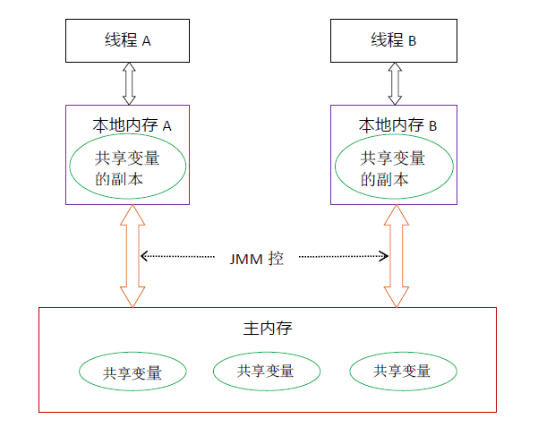
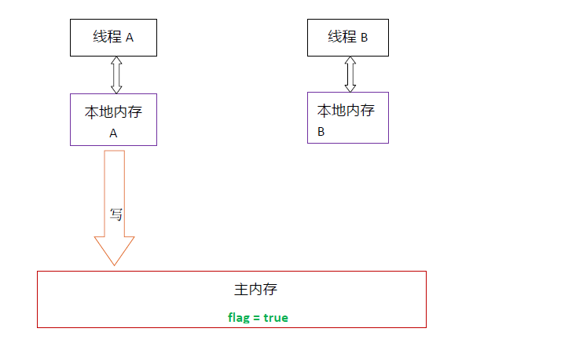
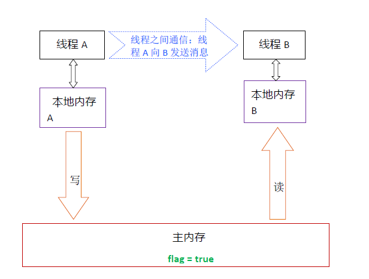

# 并发编程入门

​	多线程一词可以解释为多个控制线程或多个控制流。虽然传统的UNIX 进程包含单个
控制线程，但多线程(multithreading, MT) 会将一个进程分成许多执行线程，其中每个
线程都可独立运行。

## 1、为什么要有多线程

1. 提高程序的响应，任务是并发的 ，而不是串行等待的。
2. 有效的使用多处理器。
3. 改进了程序结构，程序改造成独立或者半独立的单元，并非整块的单个线程。
4. 对系统资源占用较少，进程有自己单独的地址空间和操作环境状态，但是线程可以共享。

## 2、java中的多线程开发

​	java中线程之间通信机制有两种：共享内存和消息传递。在java中，所有的实例域，静态域和数组元素都存储在对内存中，堆内存在线程之间共享，至于局部变量（Local variable），方法形参，异常处理不会再线程共享，不会存在可见性问题，也不会受到内存模型的影响。java线程的通信是由java内存模型（JMM）控制的，JMM决定一个线程对共享变量的写入何时对另一个线程可见，JMM定义了线程和主内存之间的抽象关系。看一个图：

从这个图我们可以看到线程a和b通信要经历两个步骤，第一个步骤，线程a把a所在的本地内存的共享变量写入到主内存中，线程b到主内存中读取线程a更新后的共享变量。

### 2.1、重排序

​	从上面看，如果一切按照顺序来的话，线程通信貌似没有什么问题，但是java为了提升执行过程中的性能，编译器，处理器都会

对指令进行重排序，一般有三种类型的重排序。

1. 编译器优化的重排序，编译器在不改变单线程程序语义的前提下，可以重新安排语句的执行顺序。
2. 指令集并行的重排序，现代处理器采用了指令级并行技术将等多条指令重叠执行，如果不存在数据依赖性，处理器可以改变语句对应机器指令的执行顺序。
3. 内存系统的重排序，由于处理器使用缓存和读写缓冲区，使得加载和存储操作看上去可能是在乱序执行。

所以，从java编译到执行过程中，会有这三种重排序现象出现，JMM对于编译器会禁止一部分重排序、对于处理器重排序，JMM的处理器重排序规则会要求java编译器在生成指令序列的时候，插入特定类型的内存屏障指令，通过内存屏障指令来禁止特定类型的处理器重排序。

### 2.2、JSR-133内存模型之happens-before

​	从jdk5版本之后，java使用新的内存模型JSR-133内存模型，JSR-133使用的是happens-before的概念来阐述操作之间的内存可见性，在JMM中就会出现这样一种情况，如果一个操作执行的结果需要对另一个操作可见，那么这两个操作之间必须存在happens-before关系。两个操作之间如果具有happens-before关系，并不意味着前一个操作必须要在后一个操作之间执行，happens-brefore规则只是要求前一个操作的结果对后一个操作可见，并且第一个操作顺序排在第二个操作之前。使用happens-before规则避免了程序员直接接触复杂的重排序规则，通过中间层JMM来约束和限定重排序规则。

### 2.3、重排序中的数据依赖性：

​		如果两个操作访问同一个变量，且这两个操作中有一个为写操作，这两个操作之间就存在数据依赖，数据依赖有三种场景：1、写后读 2、写后写 3、读后写。

​	如果重排序写和读操作，对于线程结果就不一样了。

####    2.3.1、as-if-serial语义

​	   不管怎么重排序，对于单线程而言，重排序的执行结果不能被改变，编译器，处理器都必须遵守这个规则。所以在这个规则下，如果存在数据依赖，则对这两个操作就不进行重排序。

```
int a = 3;//a步骤
int b = 5;//b步骤
int c = a * b ; //c步骤
```

数据依赖关系如下：

```
a -> c
b -> c
a - X > b(a,b之间没有数据依赖)
```

用happens-before解释

```
a happens-before b
b happens-before c
a happens-before c （规则推导）
但是根据happens-before规则，a的结果不需要对b可见，所以，a和b可以并行。
```

####     2.3.2、重排序对多线程的影响

​		由于是不同线程，数据依赖只是做到了同一个线程内的数据依赖，无法保证多线程之间的顺序执行，结果就不可预期了。

## 3、顺序一致性

### 	3.1、数据竞争

​		当程序没有正确同步的时候，就会存在数据竞争，java中内存模型规范对数据竞争的定义如下：

1. 在一个线程中写一个变量
2. 在另一个线程中读一个变量
3. 读和写没有通过同步来排序

​    当程序中包含数据竞争的时候，程序的执行就会产生违反直觉的结果。

​	JMM的规则：如果程序是正确同步的，程序的执行将具有顺序一致性，就是程序的执行结果和程序在顺序一致性内存模型中的执行结果相同。

### 	3.2、顺序一致性

​	顺序一致性的内存模型是一个被计算机科学家理想化的理论参考模型，为程序员提供了极强的内存可见性保证。它具有两个特点：

1. 一个线程中的所有操作必须按照程序的顺序来执行
2. 所有线程都只能看到一个单一的操作执行顺序。

相当于多个线程公用一个内存，在同一时间内只能有一个线程连接上内存。操作具备全序关系。（java中最早的synchronized）

###   3.3、操作原子性

​		原子操作(atomic operation)是不需要synchronized"，所谓原子操作是指不会被线程调度机制打断的操作；这种操作一旦开始，就一直运行到结束，中间不会有任何 context switch；

​		Java中atomic包中的原子操作类，提供了一些基本的原子操作。

### 3.4、volatile特性

​	当我们声明共享变量是volatile后，volatile 包含“禁止指令重排序”的语义，大概就知道了volatile的特性，

1. 可见性：对一个volatile变量的读，总是能看到（任意线程）对这个volatile变量最后的写入。
2. 原子性：对任意单个volatile变量的读写具有原子性，但类似于volatile++这种复合操作不具有原子性。

​	 实际上，volatile对程序员就很重要，因为它可以实现多线程之间的通信，从内存来讲，volkatile的写，读和锁的释放获取是一样的效果.

​	当我们去写一个volatile变量的时候，JMM会把该线程对应的本地内存中的共享变量刷新到主内存。（写完就刷新）。



​    当我们去读一个volatile变量的时候，JMM会把该线程对应的本地内存置为无效，线程会从主内存中读取共享变量。



​          总结一下volatile：

1. 线程a写一个volatile变量，实质上是线程a向接下来将要读这个变量的某个线程发出了消息（a对主内存共享变量修改）。
2. 线程b读一个volatile变量，实质上是线程b接收了之前某个线程发出的消息（a对主内存共享变量修改）。
3. 线程a写一个volatile变量，随后线程b去读取这个变量，实质上就是线程a通过主内存向线程b发送消息。

### 3.5、锁机制

​	锁是java并发编程中最重要的同步机制，锁除了让临界区互斥执行外，还可以让释放锁的线程向获取同一个锁的线程发送消息。其实就是线程a获取了锁，执行了操作之后，将线程中的本地内存的值更新到主内存，线程b获取锁之后，从主内存获取到变量，想到与两个先后线程之后的一个消息传递。

 总结一下：	

1. 线程a释放一个锁，实质上是线程a向接下来将要获取这个锁的线程b发出了一个消息（线程a修改了共享变量）
2. 线程b获取了一个锁，实质上是线程b接收了之前某个线程发出的消息（线程a修改了共享变量）
3. 线程a释放锁，随后线程b获取到这个锁，过程实质上是线程a通过主内存向线程b发送消息。

### 3.6、更进一步的锁概念 ReentrantLock

​	`ReentrantLock`中调用`lock()`方法去获取锁，`unlock()`方法去释放锁，ReentrantLock的实现依赖于java中的一个同步模型AbstractQueuedSynchronizer(AQS)，AQS使用一个整型的volatile变量来维护的同步状态，而这个volatile是ReentrantLock实现的关键。

​	在ReentrantLock中分为两种锁，一种是公平锁，一种是非公平锁。

#### 3.6.1、公平锁

​	使用公平锁的时候方法调用逻辑是这样的

```
ReentrantLock : lock()
FairSync : lock()
AQS: acquire(int arg)
ReentrantLock : tryAcquire(int acquires)
```

​	真正的到第四步骤的时候才会去加锁，加锁的时候获取的是volatile修改的变量state。

​	解锁轨迹：

```
ReentrantLock : unlock()
AQS: release(int arg)
Sync: tryRelease(int releases)
```

   第三步骤是真正的释放锁，写state变量，立即对获取锁的变量可见。

#### 3.6.2、非公平锁

​	释放和公平锁是一样的，获取是不一样的，看一下方法调用

```
ReentrantLock : lock()
NonfairSync: lock()
AQS: compareAndZSetState(int expect,int update)
```

从第三步开始真正的去获取锁

 AQS的最后一个方法 简称cas，意思就是如果当前的状态值等于预期值，则就用原子方式将同步的状态设置为给定的更新值，这个操作是原子性的。

1. 编译器不会对volatile读和volatile读后面的任意内存操作重排序。
2. 编译器不会对volatile的写和volatile写前面的任意内存操作重排序。
3. 组合一下，就可以得出，编译器不能对CAS和CAS前面和后面的任意内存操作重排序。

公平锁和非公平锁的做一个总结：

1. 公平锁和非公平锁释放的时候，最后都要写一个volatile变量state。
2. 公平锁获取的时候，首先会去读这个volatile变量。
3. 非公平锁获取的时候，首先会用CAS更新这个volatile变量，这个操作同时具有volatile读和volatile写。

### 3.7、final

​	和锁和volatile比较，final域的读和写更像是普通的变量访问，对于final定义，编译器和处理器要遵守两个重排序规则：

1. 构造函数内对一个final域的写入，与随后把这个被构造对象的引用赋值给一个引用变量，这两个操作不能重排序。
2. 初次读一个包含final域的对象的引用，与随后初次读这个final域，这个操作之间不能重排序。

对于final属性来讲，

1. JMM禁止编译器把final域的写重排序到构造函数之外。
2. 编译器会在final域的写之后，构造函数return之前，插入一个Store屏障，这个屏障就会禁止处理器把final域的写重排序到构造函数之外。
3. 在一个线程中，初次读对象应用和初次读该对象包含的final域，JMM禁止处理器重排序这两个操作。

   


