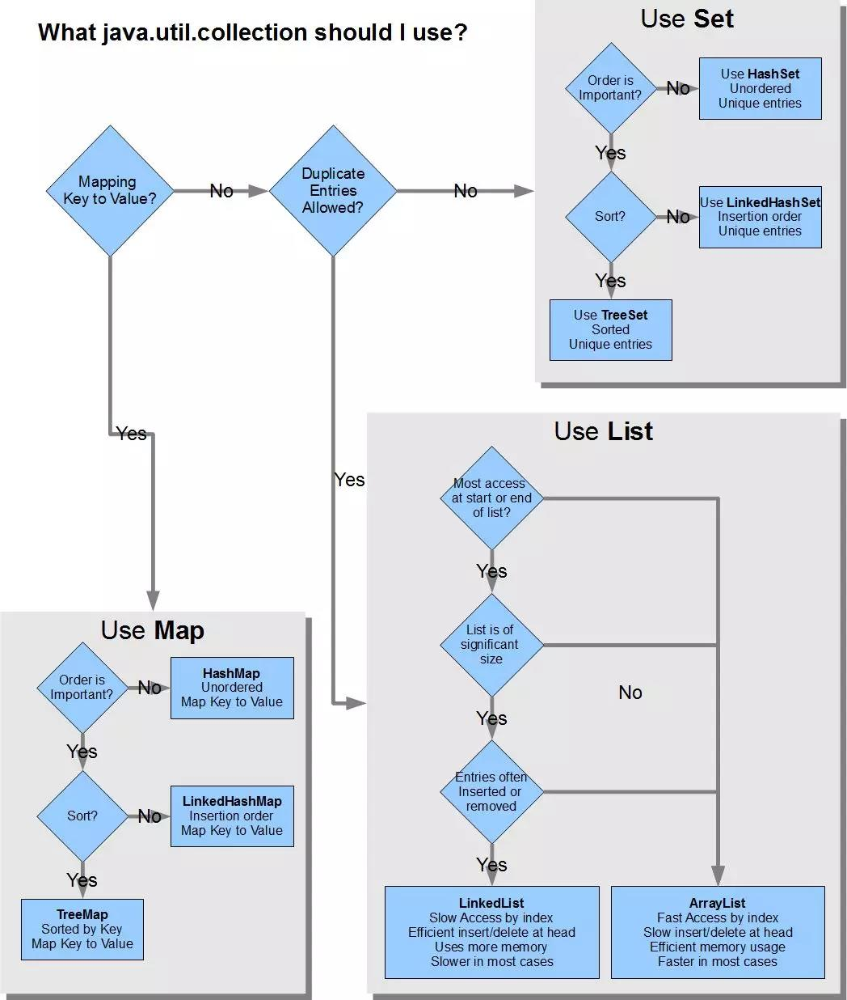
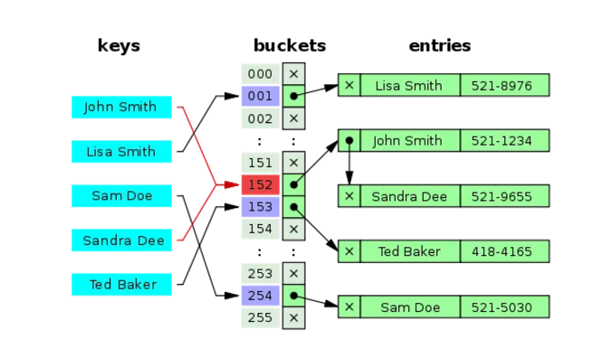

# java中的集合框架

java中关于集合的概念解释：

1. Collections框架

   泛指java中用于存储和操作集合的类库综合，包括List，Map，Set等。

2. Collection类

    Collectin是java中集合的顶级接口，其下有set list queue的接口和实现类。

3. Collections类

   Collections是一个工具类，提供了对java util包下面的集合的操作方法聚合。

## 1、集合框架概述

​	一张图说明一下java中的集合框架结构


​	从这张图可以看出来，java中的集合框架接口最顶层的有两个，`Collection`接口和`Map`接口，这样设计的好处是在顶级接口设计了很多公共的方法，子类实现之后就可以调用，对于开发者而言，方法名称一致，更易用。

   对于开发来讲，我们平时最常用的就是ArrayList(list接口下的)，HashSet(set接口下的)，HashMap（Map接口下的），其实还有更多的选择供我们使用。

​	

​		看看这张图，选择就很明确了，我们顺着理一下，是否是key-value存储，是->使用Map，不是则进入下一个判断，是否允许重复，是->List ,不是->set，大类型的选择就定下来了。

再看看小一点的类型选择：

1. 从Map来看，是否需要排序，否->hashMap, 是的话 是否插入排序 是的话：TreeMap（自然顺序），LinkedHashMap（插入顺序）。
2. 从Set来看，是否排序，否->hashSet,是否插入的排序，TreeSet（自然排序），插入顺序（LinkedHashSet，底层是链表）
3. 从List来看，对于随机访问，位置访问，选取ArrayList(底层是动态数组)，对于插入，新增，删除这些操作，LinkedList占优势，（底层是链表，方便插入，操作的数据越靠前，性能比ArrayList就越高）。

## 2、老生常谈的equals()和hashCode()方法

​	equals()和hashcode()的契约关系。

1. 如果两个对象的equals()方法判断是相等的，那么他们的hashcode也应该相等，

2. 如果两个对象通过equals()方法判断不等，那么他们的hashCode可以不相同，也可以相同。（hashcode值一样，但是不相等，在hashmap中就会有一个（LinkedList）链表来存储多个值）。看一张图

    

   ​		HashMap存储键值对的时候，会调用key对象的hashcode()方法得到一个数字，这个数字对应了键值对在HashMap中的存放位置，这个位置中会存放key和value两个值，如上图的绿色部分。

   ​		如果要通过key获取相应的value，只需要调用key的hashcode()获取到键值对的位置，就可以获取到key-value了，如果hashcode()不相等，就获取不到正确地结果了，并且，如果一个key对象的类没有实现equals()方法，默认情况下java会使用key对象的引用地址来判断两个对象的相等性，很显然，会不相等，即使获取到了相同的hash值，但是key比对不相等，依然认为是没有这个键值对的。

   ​	接着说，如果两个key对象的hash值相同，但是key的equals()判断不相同，则在存储中就会出现linkedList，获取的时候会在判断key是否相等，如果相等，则返回结果，建议不要这么做，会影响HashMap的获取速度，（一个一个比对来获取的value）。

   *这块的思想对于hashset也是一样的。*

## 3、集合框架的线程安全

​	java中有两种可以实现线程安全的手段，一种是通过java的并发管控手段（syncronized字段，其他的锁操作等），还有一种就是创建不可变量。

​	java之初，就有Vector和HashTable两个集合对象，他们通过使用syncronized关键字实现了线程安全，但是同时也暴露出了很大的性能问题。1.2之后Collections框架开始引入线程不安全的集合，如ArrayList，hashMap等等。

​		后来，Java通过Fail-Fast的Iterator来避免多个线程同时操作集合所带的线程冲突问题。比如，当一个线程正在遍历一个集合而另一个线程正在修改该集合时，前者将抛出ConcurrentModificationException。这当然也不是万全的办法。

​		Java其实也提供了线程安全的封装类（Wrapper）来实现集合的线程安全性，我们可以通过：

```
Collections.synchronizedXXX(collection)
```

​	来创建线程安全的集合，这里的XXX可以是Collection、List、Map和Set等。对于一个常规的colleciton对象，调用(synchronizedXXX)方法将得到封装后的线程安全性。

真正的直面解决问题是在1.5版本，java引入了并发集合，并发集合的策略主要有三种，一是Copy-On-Write集合，二是Compare-And-Swap集合，三是采用特殊锁的并发集合。Copy-On-Write集合底层维护的是一个不变的（Immutable）的数组，通过在写（Write）入集合时重新复制（Copy）一份新的集合来达到线程安全，进而得名Copy-On-Write。

