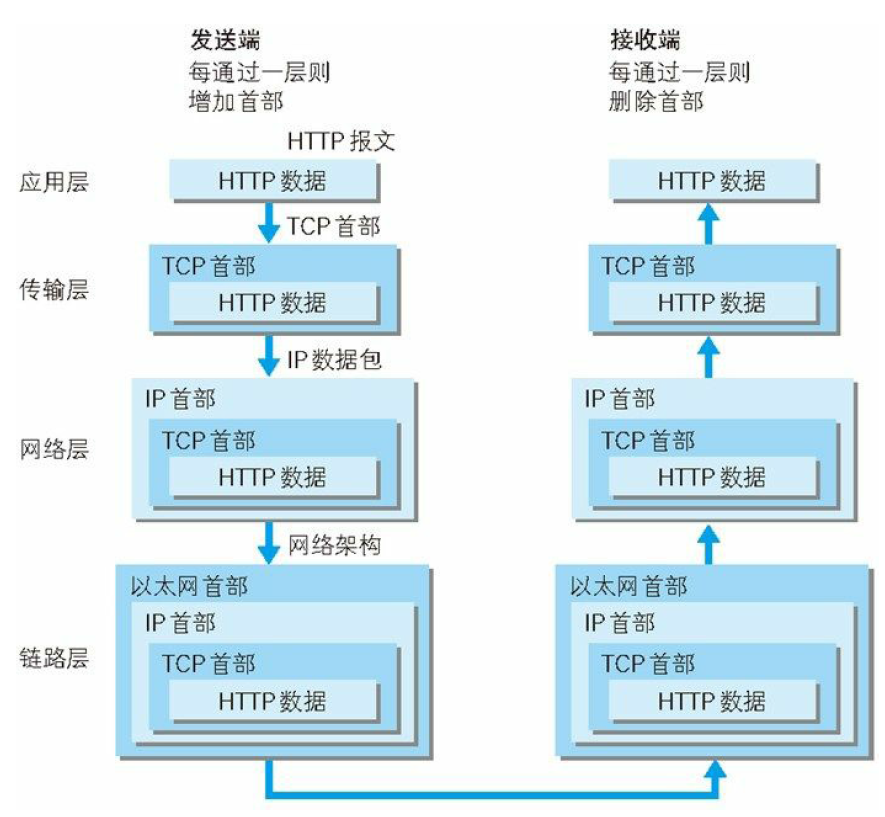
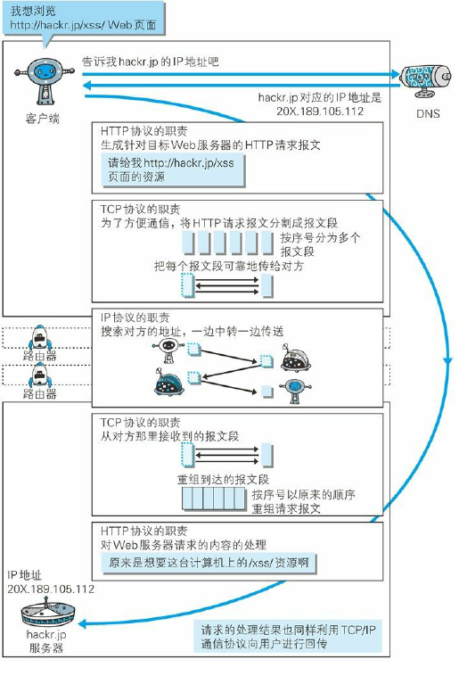
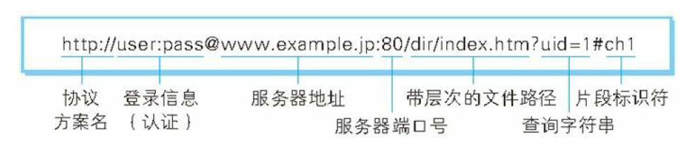

# 《图解HTTP》读书笔记

《图解HTTP》这本书是日本的上野宣写的，国内的于均良翻译，国内是在2014年出版。

## 1、内容简介和目录介绍

​	本书对互联网基盘——[HTTP](https://baike.baidu.com/item/HTTP/243074)协议进行了全面系统的介绍。作者由HTTP协议的发展历史[娓娓道来](https://baike.baidu.com/item/娓娓道来/449472)，严谨细致地剖析了HTTP协议的结构，列举诸多常见通信场景及实战案例，最后延伸到Web安全、最新技术动向等方面。本书的特色为在讲解的同时，辅以大量生动形象的通信图例，更好地帮助读者深刻理解HTTP通信过程中客户端与服务器之间的交互情况。读者可通过本书快速了解并掌握HTTP协议的基础，前端工程师分析抓包数据，后端工程师实现REST API、实现自己的HTTP服务器等过程中所需的HTTP相关知识点本书均有介绍。 [1]   --来自百度百科。

​	全书共有十一章，从web，Http的起源，到HTTP详细内容，再到web的安全，通过一百七十多张图深入讲解原理，方便易懂。

## 2、我的读后笔记

​	读后笔记按照章节记录

### 2.1、web和网络基础

####     2.1.1、发展历程

​	HTTP（HyperText Transfer Protocal，翻译过来就是超文本传输协议），完成了从客户端到服务器端的一系列运作流程。

​	1989年3月，HTTP诞生，最初是CERN（欧洲核子研究组织）的一个人提出了远程共享知识的设想，`借助多文档相关关联形成的超文本，连接成可相互参阅的www（world wide web），也就是万维网`

​	目前形成了三项WWW构件技术，SGML(standard Generalized Markup Language，标准通用标记语言)，HTML（HyperType Markup Language，超文本标记语言），HTTP文档传输协议。

​	1994 年 的 12 月，网景通信公司发布了 Netscape Navigator 1.0，1995年微软公司发布 Internet Explorer 1.0 和 2.0。

​	1995年，微软公司与网景通信公司之间爆发的浏览器大战愈演愈烈。两家公司都各自对 HTML 做了扩展，于是导致在写 HTML 页面时，必须考虑兼容他们两家公司的浏览器，之后各种浏览器层出不穷。

​     1996年之前，HTTP的版本是HTTP/0.9，1996年之后为HTTP/1.0，1997年1月是HTTP/1.1。

####  2.1.2、TCP\IP协议族

​    TCP/IP协议族，是互联网相关的各类协议族的总称，TCP/IP协议里面最重要的一点就是分层，TCP/IP协议族按照层次可以分为四层，1、应用层 2、传输层 3、网络层 4、数据链路层。

​	应用层决定了向用户提供应用服务时通信的活动，TCP/IP协议族内预存了各类通用的应用服务，如FTP，DNS。HTTP协议也在这一层。

​	传输层对上层应用层，提供处于网络连接中的两台计算机之间的数据传输，TCP和UDP就位于这层。

​	网络层用来处理在网络上流转的数据包，数据包是网络传输的最小单位，这层该规定了通过怎样的路径到达对方计算机，并将数据包传给对方。

​	链路层处理连接网络的硬件部分，包括控制操作系统，硬件的设备驱动，NIC，光纤等物理可见的部分。

   使用TCP/IP通讯的时候，会通过分层顺序和对方进行通信，发送端从应用层往上走，接收端从下层往上走，看一个HTTP的例子：

```
首先作为发送端的客户端在应用层（HTTP 协议）发出一个想看某个 Web 页面的 HTTP 请求。
接着，为了传输方便，在传输层（TCP 协议）把从应用层处收到的数据（HTTP 请求报文）进行分割，并在各个报文上打上标记序号及端口号后转发给网络层。
在网络层（IP 协议），增加作为通信目的地的 MAC 地址后转发给链路层。这样一来，发往网络的通信请求就准备齐全了。
接收端的服务器在链路层接收到数据，按序往上层发送，一直到应用层。当传输到应用层，才能算真正接收到由客户端发送过来的 HTTP请求。
发送端在层和层之间传输数据，每一次经过都会打上一个当前层的首部信息，在接收层，每一层都会去掉相应的首部信息。
```

#### 	2,1.3、IP，TCP 和DNS

​	IP协议位于网络层，作用就是把各种数据包传送给对方，这里面就会涉及到两个重要概念IP地址和MAC地址，IP地址指的是节点被分配到的地址，MAC地址指的是网卡所属的固定地址。这里面还有有ARP寻址协议。

   TCP协议位于传输层，提供了可靠的字节流服务，这块就会涉及到TCP的三次握手。发送端给接收端一个SYN标记的数据包，接收端返回一个SYN和ACK的包，发送端再次回传一个ACK的包，代表双方通信都是正常的。

​	DNS负责域名解析和HTTP一样位于应用层，用户通常通过主机名或者域名来访问对方的计算机或者服务，DNS就是通过域名来查找ip地址进行转换，（反过来ip查找域名也是他做的）。

  看看这些协议和HTTP的关系



#### 2.1.4、URI和URL

​	URI是统一资源标识符，URL是统一资源定位符。

​    URI是Uniform ，Resouce，Identifier的缩写，Uniform指的是统一的格式处理多种不同累心的资源。Resource指的是资源，可标示的任何东西，Identifier表示可以标示的对象，标识符。综合一下，URI 就是由某个协议方案表示的资源的定位标识符。除了HTTP，FTP，file还有很多协议，大概有三十多种。

一个绝对的URI地址是这样的



​	

```
使用 http: 或 https: 等协议方案名获取访问资源时要指定协议类型。不区分字母大小写，最后附一个冒号（:）。
也可使用 data: 或 javascript: 这类指定数据或脚本程序的方案名。
登录信息（认证）
指定用户名和密码作为从服务器端获取资源时必要的登录信息（身份认证）。此项是可选项。
服务器地址
使用绝对 URI 必须指定待访问的服务器地址。地址可以是类似hackr.jp 这种 DNS 可解析的名称，或是 192.168.1.1 这类 IPv4 地址名，还可以是 [0:0:0:0:0:0:0:1] 这样用方括号括起来的 IPv6 地址名。
服务器端口号
指定服务器连接的网络端口号。此项也是可选项，若用户省略则自动
使用默认端口号。
带层次的文件路径
指定服务器上的文件路径来定位特指的资源。这与 UNIX 系统的文件目录结构相似。
查询字符串
针对已指定的文件路径内的资源，可以使用查询字符串传入任意参数。此项可选。
片段标识符
使用片段标识符通常可标记出已获取资源中的子资源（文档内的某个位置）。但在 RFC 中并没有明确规定其使用方法。该项也为可选项。
```


### 2.2、简单HTTP协议